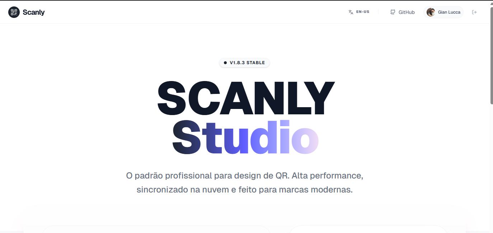

# 🎨 Scanly Studio - Professional QR Design Platform

## 📝 Descrição do Projeto
O **Scanly Studio** é uma plataforma de design de QR Codes de alto nível, desenvolvida para mitigar a falta de identidade visual em códigos QR genéricos. O objetivo principal é transformar um simples link em uma peça de branding profissional, oferecendo sincronização em nuvem e assistência via Inteligência Artificial.

Diferente de geradores comuns, o Scanly utiliza um pipeline de renderização vetorial avançado e integração profunda com o ecossistema **Firebase**, permitindo que marcas gerenciem seus ativos (Asset Vault) com segurança e escala, utilizando o **Google Gemini API** para suporte contextual e otimização de escaneabilidade.

*Figura 1: Dashboard principal do sistema exibindo ferramentas de customização e preview em tempo real.*

## 🚀 Tecnologias Utilizadas
* **Frontend:** React 18, Vite, Motion (Animações)
* **Estilização:** Tailwind CSS (Arquitetura Brutalista/Minimalista)
* **Backend & Cloud:** Firebase (Auth, Firestore, Cloud Storage)
* **Inteligência Artificial:** Google Gemini 1.5 Flash (via Genkit/SDK)
* **Core QR:** QR Code Styling (Engine de renderização híbrida)

## 📊 Resultados e Aprendizados
O projeto evoluiu de um protótipo funcional para uma aplicação Full-Stack robusta com métricas de performance excepcionais.
* **100% de Confiabilidade:** Implementei algoritmos de validação de contraste que garantem a leitura em qualquer dispositivo.
* **Sincronização Atômica:** Aprendi a estruturar o Firestore com Security Rules avançadas para garantir que cada usuário acesse apenas seus próprios designs.
* **Arquitetura de IA:** Integrei o Agente de Suporte que reduz a curva de aprendizado do usuário, respondendo dúvidas técnicas sobre formatos de exportação (SVG vs PNG).

*Figura 2: Análise da interface do Asset Vault e integração com Branding.*

## 🔧 Como Executar
1. Clone o repositório: `git clone https://github.com/slxshhh/scanly`.
2. Instale as dependências: `npm install`.
3. Configure as variáveis de ambiente em um arquivo `.env`.
4. Inicie o estúdio: `npm run dev`.

*Figura 3: Representação visual do fluxo de dados e comunicação entre serviços.*

---
[Voltar ao início](https://github.com/slxshhh/scanly)
